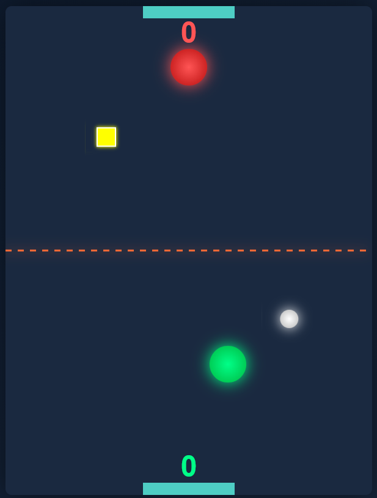

# Air Hockey Game 🏒

  

  ### [🎮 Play Now!](https://staudt.github.io/airhockey)

## About

A fast-paced browser-based air hockey game with adaptive AI, power-ups, and smooth physics. Built with vanilla JavaScript and HTML5 Canvas.

## Features

- **🎯 Adaptive AI** - CPU difficulty adjusts to match your skill level
- **⚡ Power-Up Bonuses** - Multi-disk, speed changes, size changes, shields
- **📱 Mobile & Desktop** - Works with both mouse and touch controls
- **🎨 Visual Effects** - Glowing paddles, particle explosions on goals
- **🏆 First to 7 Wins** - Fast-paced competitive gameplay

## How to Play

1. **Click "Start Game"** to begin
2. **Click your paddle** (green) to take control
3. **Move your mouse/finger** to control the paddle
4. **Click again** (or press ESC) to release control
5. **Score 7 goals** to win!

### Controls

- **Mouse/Touch**: Click paddle to grab, move to control
- **Click anywhere**: Release paddle control
- **ESC**: Release paddle control

### Power-Ups

Hit the colorful pulsing boxes with the disk to activate bonuses:

- 🟣 **Multi-Disk** - Spawns extra disks (stay until scored!)
- 🟢 **Speed Boost** - Increases disk speed
- 🔵 **Speed Slow** - Decreases disk speed
- 🟡 **Large Paddle** - Increases your paddle size
- 🟠 **Small Paddle** - Shrinks opponent's paddle
- 🔷 **Large Disk** - Increases disk size
- 💗 **Small Disk** - Decreases disk size
- 🔵 **Shield** - Blocks goals temporarily

## Technical Details

- **Pure vanilla JavaScript** - No frameworks or dependencies
- **HTML5 Canvas** rendering with gradient effects
- **Swept collision detection** - Prevents fast-moving paddle tunneling
- **Rounded corner physics** - Prevents disk from getting stuck
- **Adaptive difficulty algorithm** - AI learns from your playstyle

## Local Development

Simply open `index.html` in your browser - no build process required!

## Credits

Built with vanilla JavaScript, HTML5, and CSS3.

---

  Made with ❤️ and Claude Code

